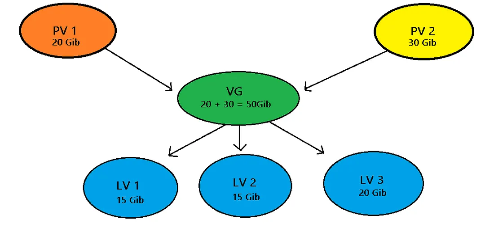

# LVM-Assignment

### USE-CASES
- Creating single logical volumes of multiple physical volumes or entire hard disks, allowing for dynamic storage resizing.
- Performing consistent backups by taking snapshots of the logical volumes.
- Using the volume management approach, the administrator is not required to allocate all disk storage space at initial setup. Some can be held in reserve for later allocation.

### DIAGRAM FOR DEEPER KNOWLEDGE:

### Key Component of LVM

#### Physical Volumes (PV):

- PVs serve as the foundation of LVM, acting as individual disks or partitions. These are physical blocks devices or other disk-like devices and are used by LVM as the raw building material for higher levels of abstraction. The LVM utility prefix for physical volumes is pv.

- PVs provide the raw storage that feeds into the broader Logical Volume Management structure, forming scalable Volume Group, allowing for scalability and efficient storage allocation.

#### Volume Group:

- Volume Groups (VGs) are the next layer in the Logical Volume Management hierarchy. They aggregate multiple Physical Volumes (PVs), forming a cohesive storage pool. The LVM utility prefix for volume groups is vg.

- VGs offer a centralized and organized approach to managing storage resources, allowing for logical partitioning and dynamic allocation through Logical Volumes (LVs).

#### Logical Volume:

- The LVM utility prefix for logical volumes is lv. An LV is similar to a partition on a physical disk. Multiple LVs can be carved out of a VG, which itself is a storage pool consisting of multiple PVs.

- The aggregate storage capacity of the PVs is abstracted by the VG in order to create logical units of storage called LVs.